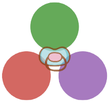

<p align="center"></p>
<h1 align="center">BabyJulia</h1>

## Overview
A grammar, parser, and interpreter for a subset of Julia that showcases Julia’s powerful and expressive type system and its key paradigm that is multiple dispatch. 

## Features
### Basic
- Variable declaration, assignment, and lookup 
- Binary and ternary operator combinations
- Control flow	
- Function definition and application 
- Struct definition, construction, inheritance, and field access
- Abstract type declaration and inheritance
- Subset of the built-in types
- Array construction, indexing, and assignment	
### Highlights
- Multiple dispatch 
- Union types 
- Type stability (minimal implementation)

## Set Up 
### Building 
```bash
yarn install # to install necessary dependencies 
yarn antlr4ts # to general ANTLR's lexer, parser, and visitor 
yarn build # to compile BabyJulia's parser and evaluator 
```
### Evaluating Programs 
```
yarn eval <the name of the file to be parsed and evaluated>
```
For example, 
```
yarn eval examples/func_def.jl
```
### Running Tests 
#### Running Single Sample Test 
Follow the step in "Evaluating Programs" section above.
#### Running All Sample Tests 
```
yarn t 
```
The output of each of the tests would be compared 
against the output stated in the examples/<test_name>_expected.txt. Note that each test file should be accompanied by a <test_name>_expected.txt file, otherwise the test would be considered failing. 


## Examples
### Evaluating Multiple Dispatch
Let’s take a look at multiple dispatch in action. The example that’s used can be found in examples/multiple_dispatch.jl and can be run using the command `yarn eval examples/multiple_dispatch.jl` after building the project (refer to section “Building”). 

In this example, we define 2 structs – Rectangle and Circle – that inherit from the abstract type Shape, and instantiate them. 
```julia
abstract type Shape end
struct Rectangle <: Shape 
end
struct Circle <: Shape 
end
r = Rectangle()
c = Circle()
```
Then, we define three methods of the `intersect` function of different type combinations, each intersecting two shapes. Note that the last method of combination Shape and Shape is called the “fallback method” as it is invoked as a fallback when there’s no method that provides more specific type combinations for some pair of Shapes.
```julia
function intersect(rectangle::Rectangle, circle::Circle)
    return "Rectangle x Circle "
end
function intersect(rectangle1::Rectangle, rectangle2::Rectangle)
    return "Rectangle x Rectangle"
end
function intersect(shape1::Shape, shape2::Shape) # fallback method 
    return "Shape x Shape"
end 
```
Now when we call the intersect function using these combinations of types, the following methods will be invoked. 
```julia
println(intersect(r,c)) # prints “Rectangle x Circle” 
println(intersect(r,r)) # prints “Rectangle x Rectangle”
println(intersect(c,c)) # falls back and prints “Shape x Shape” 
```
Let’s go through them one by one. 

When we call intersect on Rectangle and Circle instances, there are two eligible methods that can be called that are the (1) Rectangle and Circle, (2) Shape and Shape type annotated methods. Since the former method has more specific parameter annotation types (Rectangle and Circle) with respect to the instance runtime types (Rectangle and Circle), the first method is invoked, resulting in a “Rectangle x Circle” printout.    
```julia
println(intersect(r,c)) # prints “Rectangle x Circle” 
```
Similarly, when we call intersect on Rectangle and Rectangle instances, there are two eligible methods that can be called that are the (1) Rectangle and Rectangle, (2) Shape and Shape type annotated methods. Since the former method has more specific parameter annotation types (Rectangle and Rectangle) with respect to the instance runtime types (Rectangle and Rectangle), the first method is invoked, resulting in a “Rectangle x Rectangle” printout.    
```julia
println(intersect(r,r)) # prints “Rectangle x Rectangle”
```

Lastly, when we call intersect on Circle and Circle instances, there is only one eligible method that is the fallback method Shape and Shape, thus it is invoked. 
```julia
println(intersect(c,c)) # falls back and prints “Shape x Shape”
```
### Evaluating Multiple Dispatch with Union Types 
Let’s take a look at multiple dispatch and union types in action. The example that’s used can be found in examples/multiple_dispatch_union.jl and can be run using the command yarn eval examples/multiple_dispatch_union.jl after building the project (refer to section 3.1 “Building”). 

In this example, we define 3 structs – Rectangle, Circle, and Square – that inherit from the abstract type Shape, and instantiate them. 
```julia
abstract type Shape end
struct Rectangle <: Shape 
end
struct Circle <: Shape 
end
struct Square <: Shape 
end 

r = Rectangle()
sq = Square() 
c = Circle()
```
Then, we define three methods of the intersect function of different type combinations, each intersecting two shapes. 
```julia
# Uses a "quadrilateral" union.
function intersect(quad::Union{Square, Rectangle}, shape::Shape)
    return "Quad x Shape"
end
function intersect(not_really_quad::Union{Square, Rectangle, Shape}, shape::Shape)
    return "Shape x Shape"
end
function intersect(shape1::Shape, shape2::Shape) # fallback method 
    return "Shape x Shape"
end 
```
Now when we call the intersect function using these combinations of types, the following methods will be invoked. 
```julia
println(intersect(r, c)) # prints “Quad x Shape”
println(intersect(sq, c)) # prints “Quad x Shape”
```
For the two calls, the first two methods can be called; Both Rectangle and Circle are subtypes of Union{Square, Rectangle} and Union{Square, Rectangle, Shape}. However, the first method is called because Union{Square, Rectangle, Shape} condenses to Shape, and thus is more general than Union{Square, Rectangle}.

Now, let’s see what happens if we call the following example: 
```julia
println(intersect(c, c)) 
```
This call will throw an error because there are two equally specific methods that can be called - that is the second and third methods. This also shows that the second method’s union type does condense to Shape, making it equally specific to the third method’s first parameter type Shape.  

